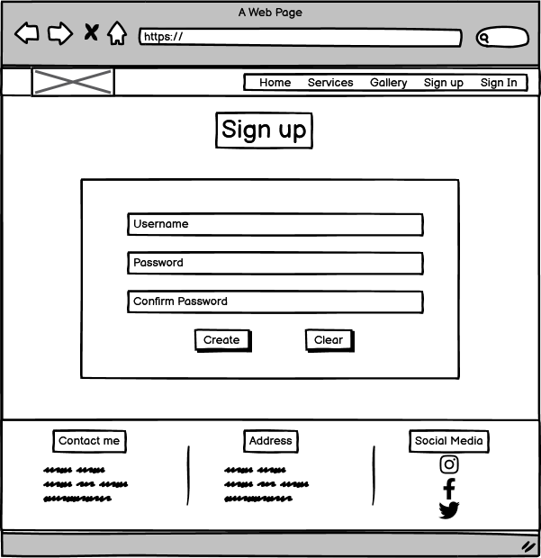
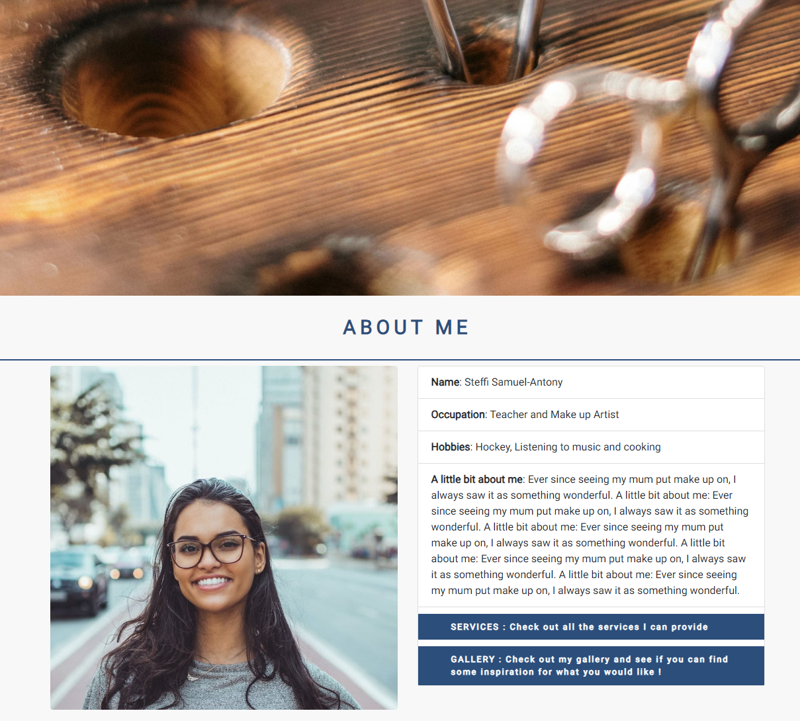
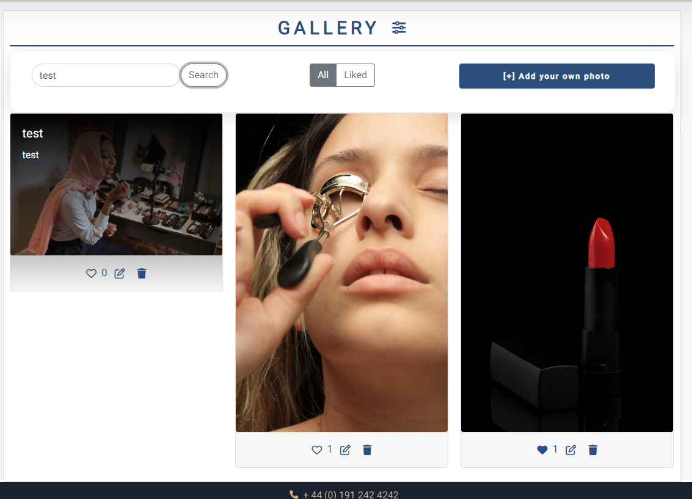
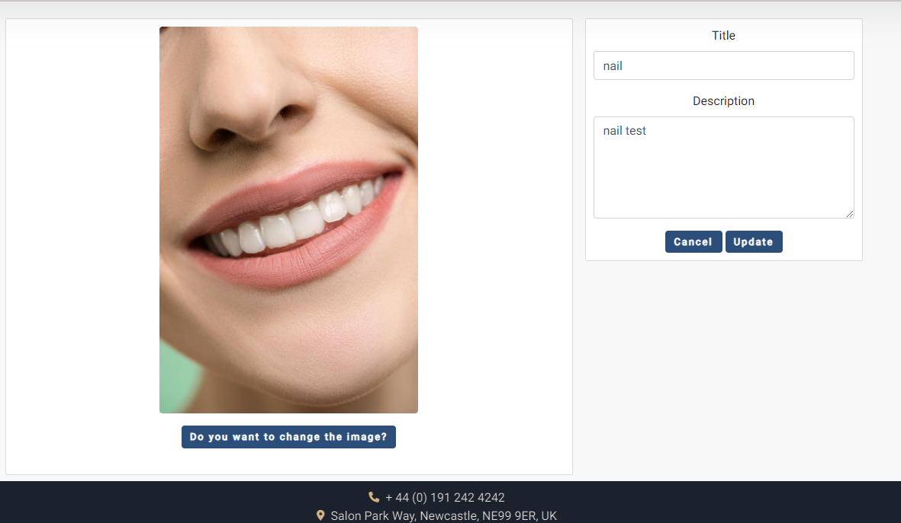
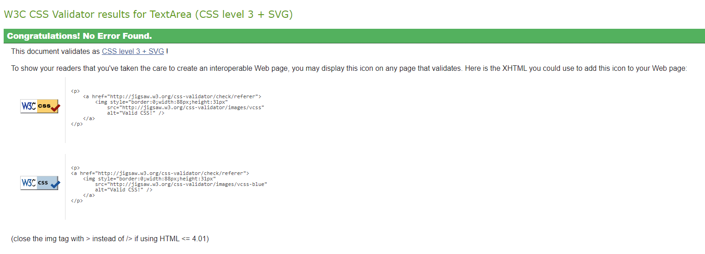
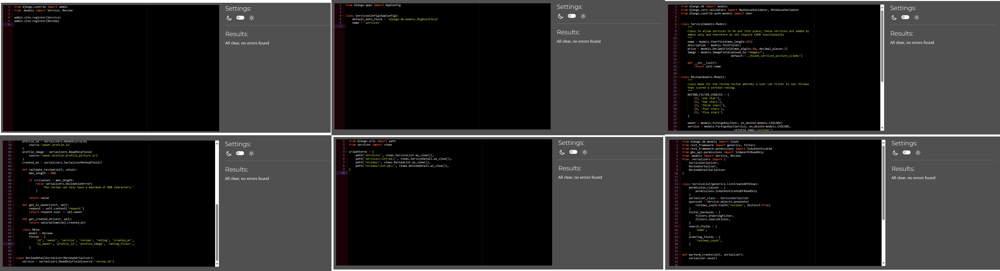

# GlowByStef

## Introduction

GlowByStef is a full-stack application dedicated to my wife's business as a make-up artist.

The app allows a user to sign up, view a gallery of work completed, filter through type of make up required e.g. weddings and birthdays. It also allows logged in users to have full CRUD functionality (create, read, use, delete) as they are able to post in a reviews section, sharing their experience, images and complete a star rating.

## Agile Methodologies

Agile principles were used throughout this project, the main uses of agile were the Kanban system and MoSCoW prioritisation method.

The Kanban system was something that allowed me to stay on target. The Kanban system was separated into 5 categories:

- Backlog - Where all initial issues are added

- To-Do - As the name suggest, the issues I will need to work on in the project

- In-Progress - The issues, I decided to work on.

- Done - All issues that have been completed

- Bug - All resolved/unresolved bugs are entered into this section.

This system allowed me to write in all my user stories and then make sure that all the requirements for the user stories to be completed could be remembered and amended as required. As I was learning throughout this project, additional user stories and other items were added onto the Kanban system.

The MoSCoW method of prioritisation was used in this projection in conjunction with the Kanban system. All issues and items added to the board contained a label which detailed if the item was a **must have** **should have** **could have**. More priority and time were given to the must have and vice versa for the could have items. 

For the final part of my project, I used a milestone to plan out the phases required for implementing CRUD funtionality onto the application. 

## User Experience (UX)

### User Stories (logged out)

- As a logged out user, I want to be able to be able to see the home page so that I can see an initial introduction to the application.

- As a logged out user, I want to be able to have the option to sign up so that I can access all the restricted content

- As a logged out user, I want to be able to sign in so that I can access all the restricted content.

- As a logged out user, I want to see validation upon not entering sufficient details in the form requirements so that I can have a safe and secure account.

- As a logged out user, I want to see validation when the correct details have not been entered when attempting to log in so that I am reminded that I have entered the wrong details.

- As a logged out user, I want to be able to click on the logo so that I am redirected to the home page.

- As a logged out user, I want to be able to see a services page so that I can see what services Stef offers.

- As a logged out user, I want to be able click on the services so that I can see more details of the service.

- As a logged out user, I want to be able click on the gallery page so that I can see what users have posted and how many likes it has so that I can see what style I'd want.

- As a logged out user, I want to be able to click on the socials in the footer so that I can follow the Stef on social media.

### User Stories (logged in)

- As a logged in user, I want to have a success message displayed when I log in so that I am aware that the log in was successful.

- As a logged in user, I want the corresponding accessible profile picture to appear so that I am aware that I am logged in to the correct account.

- As a logged in user, I want the navigation bar to present itself with different navigation links so that I can access the user restricted pages.

- As a logged in user, I want to be able create a review so that I can leave my feedback on a service.

- As a logged in user, I want to edit my review so that I can change the review.

- As a logged in user, I want to be able to view all reviews left for Stef so that I can make an informed decision on contacting her for a make-up consultation.

- As a logged in user, I want to be able to delete my review so that I can remove it from being seen.

- As a logged in user, I want to be able to save Stef's make up styles so that I can come back to it later.

- As a logged in user, I want to be able to view all of my saved items so that I can remind myself of what I saved.

- As a logged in user, I want to be able to filter through my saved items so that I can find what I am specifically looking for.

- As a logged in user, I want to access my profile data when I click on the profile image so that I can see the profile details.

- As a logged in user, I want to be able create a gallery post so that I can show others what styles I had done on myself.

- As a logged in user, I want to edit my gallery image so that I can change the content.

- As a logged in user, I want to be able to see what images have the most likes to that I can see what the most popular styles are.

- As a logged in user, I want to be able to delete my image so that I can remove it from being seen.

### Developer Goals

- The site should restrict users from entering invalid data into forms

- The form must contain placeholder text in all fields to make it easier for the user to use.

- A notification must appear when an account has been created.

- A notification must appear when a user has logged in.

- A notification must appear when a user has logged out.

- The application must be responsive to varying screen sizes.

- The colour scheme used in the application must be consistent and appealing to look at.

### Expectations

- I expect a logged in user to have full CRUD functionality of reviews.

- I expect there to be a clear restriction in access for logged in and logged out users.

- I expect the any user to be able to see the services provided by GlowByStef.

- I expect all user data to be stored safely in django-rest backend.

- I expect all the front end to be completed using React and React-Bootstrap.

- I expect a logged in user to have full CRUD functionality of gallery images.

### Requirements

- The application must have clearly legible font.

- The application must have attractive to look at.

- The application must be intuitive, using icons that are the industry standard.

- The application must have all working functions.

- The application must have clear validation.

- The application must provide error messages and error pages when incorrectly accessed.

- The application must restrict content and not allow logged out users to access logged in utilities.

## Design & Structure

The design aspect of the project was something that I felt I was more confident with than previous projects. I've learned how to find and utilise contrasting and matching colours which entices the user to stay and use the application.

The main decisions made in the design elements were influenced mainly by research conducted. The research was completed by comparing multiple applications that had a similar user stories as my own. From my research, it was obvious to see that the main principle followed by all of the applications was minimalistic.

Another main component that was researched was CRUD functionality for users. It was identified that the vast majority of functionality was displayed with easily recognised icons. This is something that is implemented into the application.

### Colour Scheme

As stated previously, the main element of design is being minimalistic. However whilst being minimalistic, contrasting colours are required for the highest level of engagement and to keep the interest alive. The colours used are also symbolic of colours often observed in make up palettes. The colour scheme and palette were created using [Coolors]([[https://coolors.co/?home]. "Coolors").

| Colour (HEX) | Use |
| ------------ | ----------------------------------------------------------------------------------------------------------------------------------- |
| CDB4DB | This is a light colour used for cards, various backgrounds and to match the remainder of the page. |
| FFC8DD | This is a light colour used for cards, various backgrounds and to match the remainder of the page. |
| FFAFCC | This is a slightly darker colour than the previous colours which will be used for borders and to show clear separation. |
| BDE0FE | This is a light colour used for cards, various backgrounds and to match the remainder of the page. This is also used as text colour. |
| A2D2FF | This is a light colour used for cards, various backgrounds and to match the remainder of the page. This is also used as text colour. |
| 24517C | This is dark tone that will be used for headers and footers |
| 1F2224 | This is the colour that will be used as the font colour for headers. |

### Icons

Multiple icons are used throughout the webpage, this is to increase the user experience and make the purpose of buttons / information sources easier to understand. [Font Awesome]([[https://fontawesome.com/ "Font Awesome") was used as the source of the icons.

[Favicon]([[https://favicon.io] "Favicon") was also another source of icon used however this supplied an identifier for the website when a user visits. The icon is recognisable and is indicative of the type of website.

### Font

The aim of the application is to display elegance, vibrance and professionalism. All of these requirements were considered when picking the font. The fonts that have been decided for the project are:

- [Dancing Script]([[https://fonts.google.com/specimen/Dancing+Script] "Dancing Script") - A font used very minimally throughout the project but used for some text that require an extra flare.

- [Roboto]([[https://fonts.google.com/specimen/Roboto] "Roboto") - The main eye catching font used for titles and descriptions.

Both of theses fonts were found using [Google Fonts]([[https://fonts.google.com/] "google fonts")

### Breakpoints

For breakpoints within this website, there were some minor aspects using media queries however the vast majority of the breakpoints were controlled using bootstrap elements. The main requirement of the breakpoints were to set a limit, that being that as per bootstrap documentation, the minimum size the website must be functional and responsive to is 320px.

### Wireframes

## Database Structure

### Profile Model

| Field Name | Type | Default Value |
| ---------- | ------------- | ------------------------------ |
| owner | OnetoOneField | User, on_delete=models.CASCADE |
| created_at | DateTimeField | auto_now_add=True |
| updated_at | DateTimeField | auto_now=True |
| name | CharField | max_length=255 |
| bio | TextField | blank=True |
| contact_number | CharField | max_length=20, null=True |
| profile_picture | ImageField | upload_to='images/', default='../blank_profile_picture_n727ay' |

### Service Model

| Field Name | Type | Default Value |
|-------------|--------------|-----------------------------------------------------------------|
| name | CharField | max_length=255 |
| description | TextField | () |
| price | DecimalField | max_digits=10, decimal_places=2 |
| image | ImageField | upload_to="images/", default='../blank_services_picture_lc3p4z' |

### Review Model

| Field Name | Type | Default Value |
|---------------|---------------|--------------------------------------------------------------------------------------------------------------|
| owner | ForeignKey | User, on_delete=models.CASCADE |
| service | ForeignKey | Service, on_delete=models.CASCADE, related_name='reviews' |
| review | TextField | () |
| rating | IntegerField | default=1, validators=[ MaxValueValidator(5), MinValueValidator(1) ] |
| created_at | DateTimeField | auto_now_add=True |
| rating_filter | IntegerField | choices=RATING_FILTER_CHOICES, null=True, blank=True, |

### Gallery Model

| Field Name | Type | Default Value |
|-------------|---------------|-------------------------------------------------------------------|
| owner | ForeignKey | User, on_delete=models.CASCADE |
| created_at | DateTimeField | auto_now_add=True |
| title | CharField | max_length=255 |
| description | CharField | max_length=500 |
| image | ImageField | upload_to='images/', default='../default_post_f8mypf', blank=True |

### Like Model

| Field Name | Type | Default Value |
|------------|---------------|---------------------------------------------------------|
| owner | ForeignKey | User, on_delete=models.CASCADE |
| gallery | ForeignKey | Gallery, on_delete=models.CASCADE, related_name='likes' |
| created_at | DateTimeField | auto_now_add=True

## Existing Features

### Reusable Components

The first reusable component in my application is my GalleryCard component. It contains various props such as **id**, **is_owner**, **title**, **description**, **image**, **likes_count**, **like_id** etc. The component contains features that allow a user to have a great deal of interactivity. It enables a user to see the content, it contains the image, the title and description, but also allows a logged in user to upload an image, edit their image, like an image, unlike an image and delete their image if they chose to do so. The component also uses multiple React bootstrap variables such as Card, Button and Overlay Trigger which means that it is responsive to all different environments.

The second reusable component in my application is my ServiceCard component, this component works along the same lines as the GalleryCard component, however, with no user interactivity, the aim of this card is to get information about services from the back End API and map through the services to show **service type**, **a short description** and **cost**. All this combined fulfils it's requirements of being reusable and responsive to any input.

### Navbar

The navbar is a fully responsive navigation bar that enables a user to easily access all parts of the application easily. The navbar follows the same colour scheme as the page so that the graphics are consistent. The navbar is also responsive so that when a user is using the application on a small screen size, the navigation links turn into a burger icon which when pressed expands to show all the links. When a user taps a link the expanded navigation reduces it self back to the original state. 

### Home page

This is the first page that the user experiences when coming onto the application, it shows a large image that's spread across the page showing the user what the overall aim of the application is. It also contains a picture of Stef along with a bio and two links which enables users to navigate to the services and gallery page. The aim of this is to add depth to the user and make sure that they're connecting personally to the application owner. 

  
### Contact me section and footer

The contact me section is a section where in details are shared about opening times, motto and is decorated in a style that takes the theme of the application. This section also contains information that informs a user that when contacting Stef it must be planned 2 weeks in advance to take traffic into consideration.

The footer is a contrasting colour to the rest of the page which makes it stand out of the page. It’s also separated into 3 sections of the logo, address and the social links. This is a pivotal part of the website as it is a direct route to contact Stef.

### Services page

The services page contains multiple cards that contain services provided by Stef. Each card contains an image, the title, a description and a price. Through research, this feature was popular amongst other salon related services. The services page is also fully responsive and on smaller screens, each service is stacked on top of each other.

The services page uses a component service card to ensure that anything added by the admin e.g. a new service, is dynamically created and fits in with the consistency of the other services. This shows aspects of professionalism which is great for user interactivity.

### Gallery page (All CRUD functionalities)

The gallery page is the best place for a user to visit as it will give inspiration to the user to decide what kind of service they would like and something to show Stef as an example of the type of style. This also showcases the skills of Stef and builds a reputation for Stef. Additional functionality is that a non logged in user can see the amount of likes a gallery has and also a heart that has a hover effect with a tooltip that tells the user to log in to be able to like a post.

When logged in the user is able to like a post which appears as a block colour when liked and unlike a post when clicked again.

There is also a filter button which extends the ability for the user to be able to filter based on search results or based on what the user has liked. This enables the user to have interactivity with the application but also can focus on exactly what they are after.

#### Filters

This is a section that uses components multiple times in a loop to ensure that anything added by the admin and user, is created and added automatically. This is then formatted in the same templates as the other gallery card for consistency. The layout of the images are placed in a way that is not uniform as a strict images page makes the page seem more restrictive. There are also icons in the the gallery card that enables one to edit, and delete their own image. This feature is strictly only present on images that were posted by the user. This feature is not present at all for users who are not logged in. 

### Sign In & Sign Up page

The Sign in page features an attractive entry to allow users to log into the page, it features a form where a user can log in, and on the right of it, a picture that’s light and reflects the purpose of the website, additional through research I saw that most websites did not have a sign up navigation link, rather a sign in with a link that points to a sign up page if a user wants to make an account. This is the same principle that I followed and the clicking the sign up button leads to another page whereby the user can create a username, password and confirm the password.

### Sign out function

The sign out function as the name states allows the user to sign out and is redirected to the home page.

### Toasts

Toasts are an implementation that enables a user to know that their interaction has been registered and is succesful. The toast appears for 5 seconds, has a timer and automatically closes, the toast can also be closed manually or slid.

#### Sign In Toast

#### Sign Up Toast

#### Sign Out Toast

#### Gallery Created Toast

#### Gallery Edited Toast

#### Gallery Delete Toast

## Future implementations

In the future, the features I’d like to include are:

- Booking appointments

- Paying for said booked appointments in advance

- The ability for users to review each service which would then be reflected within a star rating.

- Other users can then use that rating and review any feedback left behind by other clients.

- Ability to view, edit and delete ones own profile.

These features are important aspects to make a more refined and finished product. However, due to time constraints I was no able to fulfil all the actions of this project that I initially intended. I intend to continually improve this website to make it functional and appealing for Stef’s clientele.

## Technologies Used

### Languages

- [HTML5]([[https://www.w3schools.com/html/] "HTML5") - integrated mostly into my react code, but a great language for web development.

- [CSS3]([[https://www.w3schools.com/css/] "CSS3") - if you're wondering why my page looks so good, just have a look at my CSS

- [Python]([[https://www.python.org/] "Python") - a logical coding language, with strong capabilities in databases and back end work.

- [React]([[https://react.dev/] "React") - A logical coding language. Ideal for frontend development.

### Libraries and Frameworks

- [Django Rest Framework]([https://www.djangoproject.com/] "Drango Rest Framework") - A powerful toolkit for building web APIs. Using DRF extends the capabilities of Django.

- [Cloudinary]([https://cloudinary.com/] "Cloudinary") - A cloud based platform that allows upload, store and management of a wide range of media.

- [Gunicorn]([https://gunicorn.org/] "Gunicorn") - A widely used WSGI, perfect for working with frameworks like Django

- [Psycopg2]([https://pypi.org/project/psycopg2/] "Psycopg2") - A PostgreSQL adapter which allows for python based applications to communicate with PostgreSQL databases.

- [Google Fonts]([https://fonts.google.com/] "Google Fonts") - A great tool to be able to see samples of what text you'd want on your website.

- [React-Bootstrap]([https://react-bootstrap-v4.netlify.app/] "React-Bootstrap") - Bootstrap but for react, I used it for an an easy and efficient way to create a clean responsive website.

- [React Toastify]([https://www.npmjs.com/package/react-toastify] "React Toastify") - An amazing library that makes adding a toast onto any element much simpler. 

### Tools

- [GitPod]([https://www.gitpod.io/] "GitPod") - Cloudbased IDE, great for collaborative software development.

- [GitHub]([https://github.com/] "GitHub") - a website that aids software development and version control.

- [Git]([https://git-scm.com/] "Git") - version control system that tracks changes in source code in the development phase.

- [Heroku]([https://www.heroku.com] "Heroku") - cloud based platform for deploying applications.

- [ElephantSQL]([https://www.elephantsql.com/] "ElephantSQL") - cloud based PostgreSQL database service

- [SQLite3]([https://www.sqlite.org/index.html] "SQLite3") - a serverless open-source database, perfect for local development.

- [FontAwesome]([https://fontawesome.com/] "FontAwesome") - one of the best things ever, every single icon you need is in here.

- [AmIResponsive]([https://ui.dev/amiresponsive] "AmIResponsive") - a great tool for your projects, shows you what you application looks like on different screen sizes.

- [Balsamiq]([https://balsamiq.com/wireframes/?gad=1&gclid=CjwKCAjwr_CnBhA0EiwAci5sikJlbA3yk1dYGRdNiY0Krv7_98bWbqabFd_DxfjzG1-J7kWnl2-byhoC2cIQAvD_BwE] "Balsamiq") - A programme for wireframing and prototyping, just the thing you need to plan out your projects.

- [W3C CSS Validator]([https://jigsaw.w3.org/css-validator/] "W3C CSS Validator") - validates your CSS

- [CI pep8 linter]([https://pep8ci.herokuapp.com/] "CI pep8 linter") - validates your python code

- [JShint linter]([https://jshint.com/] "JShint linter") - validates your JS/React code.

- [Lighthouse]([https://developer.chrome.com/docs/lighthouse/overview/] "Lighthouse") - reviews accessibility and shows best practises to make application viable on all platforms.

- [Lucid Chart]([https://www.lucidchart.com/pages/] "Lucid Chart") - A tool to be able to create database diagrams and relationships.

## Testing 

The back end testing and front end testing was separately and combined to see what the overall result would be, especially to test out the CRUD functionalities. 

### Responsiveness Testing

The breakpoints that were tested were through bootstrap recommendations. 

| Screen Size | is it responsive? |
|--|--|
| <576px | Yes |
| ≥576px | Yes |
| ≥768px | Yes |
| ≥992px | Yes |
| ≥1200px | Yes |
| ≥1400px | Yes |

All responsiveness tests passed. 

### Browser Testing

Three Browsers were tested to make sure they facilitate all functions required by the application and all aspects of the application are clear.

| Browser | Result |
|--|--|
| Microsoft Edge | Pass |
| Mozilla Firefox | Pass |
| Google Chrome | Pass |

All browser testing passed. 

### All users

| Test | Outcome | Pass or Fail |
| ---------------------------------------------------- | ------------------------------------------------------------------------- | ------------ |
| Clicking the logo | Redirect to home page | Pass |
| Clicking the Home button in the Nav Bar | Redirect to home page | Pass |
| Clicking the Services Button in the Nav Bar | Redirect to services page | Pass |
| Clicking the Gallery Button in the Nav Bar | Redirect to gallery page | Pass |
| View the navbar on a small screen | Burger Icon appears | Pass |
| Click on burger Icon | all relevant buttons are present | Pass |
| On small screens, click on the Home button | Redirect to home page & Burger menu retracts | Pass |
| On small screens, click on the services button | Redirect to services page & Burger menu retracts | Pass |
| On small screens, click on the gallery button | Redirect to gallery page & Burger menu retracts | Pass |
| On small screens, click outside of the menu dropdown | Burger menu retracts | Pass |
| On normal screens move mouse over NavBar links | Hover effect takes place | Pass |
| Content: Click on home page | Cover photo, portrait and Bio present | Pass |
| Content: Click on services page | Cards present with service Image, title, description and price | Pass |
| Content: Click on Gallery page | Cards present with image, title, description, hover effect and like button | Pass |
| Attempt to access a URL that doesn't exist | Redirected to a not found page | Pass |

### Logged out Users

| Test | Outcome | Pass or Fail |
| --------------------------------------------- | ---------------------------------------------------- | ------------ |
| Clicking on the Sign in button | Redirect to Sign in page | Pass |
| Clicking on the Sign up button | Redirect to Sign up page | Pass |
| On small screens, click on the sign up button | Redirect to sign up page & Burger menu retracts | Pass |
| On small screens, click on the sign in button | Redirect to sign in page & Burger menu retracts | Pass |
| Content: Click on Sign up page | Sign up section with an image on the right hand side | Pass |
| Content: Click on Sign in page | Sign in section with an image on the right hand side | Pass |
| Click on the like button | A message appears saying log in to like | Pass |
| Attempt to access a user restricted URL | Redirected to home page | Pass |
| Attempt to access a user restricted URL in the backend | Not authenticated to access the admin page | Pass |

### Logged in Users

| Test | Outcome | Pass or Fail |
| ---------------------------------------- | ------------------------------------------------------------------------- | ------------ |
| Backend: review services list view | list view present with correct entries| Pass |
| Backend: review services detail view | detail view present with correct entries | Pass |
| Backend: review reviews list view | list view present with correct entries| Pass |
| Backend: review reviews detail view | detail view present with correct entries | Pass |
| Backend: review galleries list view | list view present with correct entries| Pass |
| Backend: review galleries detail view | detail view present with correct entries | Pass |
| Backend: review likes list view | list view present with correct entries| Pass |
| Backend: review likes detail view | detail view present with correct entries | Pass |
| Backend: review profiles list view | list view present with correct entries| Pass |
| Backend: review profiles detail view | detail view present with correct entries | Pass |
| On the gallery page, click on the filter icon | All filterable elements and upload button present | Pass |
| On the gallery page, click on the filter icon again | Filterable elements disappear | Pass |
| On the gallery page, with the filter on, search a present image and click search | relevant images appear | Pass |
| create a service in the back end | new service updated | Pass |
| edit a service in the back end | service updated with new details | Pass |
| delete a service in the back end | service deleted | Pass |
| create a gallery to the back end | new gallery image appears | Pass |
| edit a gallery item in the back end | gallery updated with new details | Pass |
| delete a gallery item in the back end | gallery deleted | Pass |
| check order of gallery posts | ordered by created at date | Pass |
| create a new profile | Backend shows username info for new sign in | Pass |
| search a non-present image and click search | no image found image appear | Pass |
| search any value and press enter | required search result is progressed | Pass |
| click on the liked button | only images the user has liked appears | Pass |
| click on the all button | all images appear | Pass |
| click on the upload button | redirected to upload page | Pass |
| click on the upload image | windows opens up to upload an image | Pass |
| select an image to upload | preview of image shown on the application | Pass |
| click on the cancel button | redirected to gallery page | Pass |
| click on the create button | redirected to gallery page & uploaded image visible | Pass |
| Check back end for frontend created image | image details present | Pass |
| click on the update button on users gallery image | redirected to the update page , and previous information prior to update is present | Pass |
| Check back end for frontend updated image | image details present | Pass |
| click on the cancel button | redirected to gallery page & no changes made to image| Pass |
| click on the save button | redirected to gallery page & updated details visible | Pass |
| click on the delete button button | gallery page updated with deleted image not being present. | Pass |
| Check back end for frontend deleted image | image details not-present | Pass |
| click on the edit button on another user's post | no button present | Pass |
| click on the delete button on another user's post | no button present | Pass |
| access another users image by manually accessing the URL /gallery/update/{id} | user redirected to home page | Pass |
| Once logged in, click on sign out button | Redirected to the home page and Navbar offers sign in and sign up options | Pass |
| Once logged in, click like button | Image liked | Pass |
| Once logged in, click like button | Like Count + 1 | Pass |
| Once logged in, click on sign out button | Redirected to the home page and Navbar offers sign in and sign up options | Pass |

### Lighthouse testing

#### Desktop

#### Mobile

As the screenshot below shows, the lighthouse testing is successful and has a high rating for accessibility. This means that a user who is impaired in any nature is able to access the application and know what is happening.

The performance rating however is low, and at random points of testing, even lower results were observed at close to 40. The main concerns observed were that the images were too large for the document being loaded. Due to time constraints, I wasn't able to focus too heavily on this but I plan on fixing this in the future.

### JShint testing

All React code was passed through linter and was found to relay with no errors.

### CSS validation

#### App.module.css

#### Asset.module.css

#### Avatar.module.css

#### Button.module.css

#### FiterBar.module.css

#### Footer.module.css

#### Gallery.module.css

#### Home.module.css

#### NavBar.module.css

#### NotFound.module.css

#### SearchBar.module.css

#### Services.module.css

#### SignInUpForm.module.css

All CSS code was passed through validation and no errors were found.

### Python Pep8 validation

#### API

#### Galleries

#### Profile

#### Services

all python code was passed through validation and no errors were found.

## Bugs

During the process of coding, I ran across multiple bugs that took a really long time to fix.

CORS error, this error cost a lot of time and effort. As continuous researching and asking others for help didn’t provide any functioning responses. The best option was to combine the workspaces in order to remove the CORS error. Combining the workspaces was probably one of the better things I did in this project as I was able to edit both the backend and the front end easily and quickly. And I only needed to write 1 readme, which is always a plus.

Like/ Unlike not functioning. This error was another time consumer as every time a post was liked, the whole page would go blank. Multiple errors were identified wherein the function of handleLike and handle unlike were not performing as it should. To fix this, I used the like_id and likes_count from the API response to set the initial states of the the likes_count and like_id variables. Then these variables were implemented into the handleLike and handleUnlike functions

## Unfixed Bug

On random occasions when liking a post the page is not responsive and then goes blank. However once hard refreshed, the action works as intended. I’m not sure exactly why this happens or how to recreate it but it would be at random intervals.

Also at random occurrences, when a user searches for a gallery image, the not found icon appears for a split second which immediately moves onto the correct search result. Again this could not be recreated and no errors occurred therefore a fix could not be implemented.

The images uploaded on the website were too large and therefore has caused some issues with loading speed, this is a hinderance for usability however, due to time constrains I was not able to deal with the situation sufficiently. 

On some occations of testing the application on lighthouse, the performance was observed to be low on mobile mode, (below 50) I investigated this however, even after lowering the image sizes, the low result still occurred, however on other occasions of testing, the results were 75+. As a clear root cause could not be identified. Due to this and time constraints I was not able to fix this bug.

## User Story Reflection

Upon reflecting on the user stories set at the start of the project, I was not able to meet all the goals I set out to. This is due to multiple reasons such as bugs taking a long time to fix and also because of time constraints outside of the coding environment. However, I am proud to say that this is a good start and a solid backbone for me to be able to add more functions and capabilities. I plan to continue working on this project to make it an application that is perfect for the purpose. The back end of the project contains all the requirements necessary to implement these functionalities.

The application has a clear navigation pathway for all users, whether they are logged in or not. The navigation is responsive and easy to use (user story 12). The application is presented clearly (user stories 1, 6, 7, 9), using contrasting colour schemes and clear text. A user is able to log in to their account or sign up if not done previously and when done so, they are notified (user stories 2, 3, 4, 5, 21, 10). This is also reflected when a logged in user, logs out. The user is able to view services that Stef provides(user stories 7, 22), this covers the title, description and image and price. The user can complete full CRUD functionality on gallery images (user stories 19, 23, 26, 27, 28, 29, 30), therefore, they are able to create, read, update and delete their own gallery images. A user is also able to like specific images which go up in count when liked and down in count when unliked( partial completion of user story 14). The user can filter through the results of the page by either selecting liked, so only having liked images or search specific results. All of these aspects are notified to users.

The user stories I was not able to fulfil were:

- As a logged in user, I want to be able create a review so that I can leave my feedback on a service.

- As a logged in user, I want to edit my review so that I can change the review

- As a logged in user, I want to be able to view all reviews left for Stef so that I can make an informed decision on contacting her for a make-up consultation

- As a logged in user, I want to be able to delete my review so that I can remove it.

- As a logged in user, I want to be able to delete my review so that I can remove it from being seen.

- As a logged in user, I want the corresponding accessible profile picture to appear so that I am aware that I am logged in to the correct account.

- As a logged in user, I want to access my profile data when I click on the profile image so that I can see the profile details.

All other aspects that were targeted have been met to the best of my capabilities

## Deployment

### Forking

If you would like to fork any repositories, follow the steps below:

- Log in to **GitHub**.

- Navigate to the [GlowByStef]([[https://github.com/AlexAntony3/glowbystef] "glowbystef").

- At the top of the page, locate the **fork** icon

- Click on the **downward** icon next to fork and press **create a new fork**.

- Select an **owner** for the repository

- **Change** the name of the repository if required

- Choose whether to **copy** all branches or just the `default` branch.

- Click the Create Fork button and you have forked my repository.

### Cloning

If you would like to clone any repositories, follow the steps below:

- Log in to **GitHub**

- Access the required repository or my repository by clicking the following link: [GlowByStef]([[https://github.com/AlexAntony3/glowbystef] "GlowByStef")

- Click on the `<> Code` button.

- In the **local** tab, select the **HTTPS** button and copy the URL.

- Open up a new workspace

- Use the `git clone` command In the command line of the workspace, paste in the copied URL. It should look like this:

git clone [https://github.com/YOURUSERNAME/YOURREPOSITORY].

- Press **Enter** and the repository will be cloned!.

- After forking the repository, follow the cloning method to continue with development.

- Once you're repository is set up, open the repository on **Gitpod** and you need to download all the libraries and frameworks.

> pip3 install -r requirements.txt

- Create an **env.py** in the root directory and enter the following:

**Note: the values for each key must not be shared and must be the same as what's entered into Heroku **

    os.envrion['DATABASE_URL'] = "elephantSQL url"
    os.environ['SECRET_KEY'] = "secret key you created"
    os.environ['CLOUDINARY_URL'] = "APU url from cloudinary, **remember to remove the CLOUDINARY_URL=' from the URL**"

- Now migrate all the models by entering:

> python3 manage.py migrate

- The next step is to create a superuser to be able to access the Django admin panel.

> python manage.py createsuperuser

When creating a superuser, enter a username, email (optional) and password twice. When typing the password, it will not appear but it is being registered.

- now we're nearly done! in the **settings.py** add:

> .[herokuapp.com]([http://herokuapp.com/] "Heroku"), localhost

- Finally commit and push the changes and you're good to go!

**Note: Make sure that the env.py variables are the same as what's entered into the config vars on Heroku. If this has not been completed yet, follow the next steps.**

### Heroku Set up

- Log in to your [Heroku]([[www.heroku.com] "Heroku") account and create an app. Choose an original name and select an appropriate region.

- Go to the **settings** page and click **Reveal Config Vars** in the key and port values type the following:

| Key | Value |
| --------------------- | -------------------- |
| PORT | 8000 |
| DATABASE_URL | Same entry as env.py |
| SECRET_KEY | Same entry as env.py |
| CLOUDINARY_URL | Same entry as env.py |
| DISABLE_COLLECTSTATIC | 1 |

- Click on the **Deploy** button and if the website appears you're officially ready to go!

- To run the code on the development tool, type in the following to the terminal:

> python3 manage.py runserver

**Enjoy**

## Deploying the front end

### To deploy the front end follow these steps:

Log into Heroku, create a new app to the region that is closest to you and select a unique name.

In the deploy tab, connect the deployment method via GItHub and select the repository that you want to deploy.

Click deploy branch on main and watch the magic happen.

(Optional extra) Click on enable auto deploy which will deploy whenever the repository is pushed.

After deploying the app, click view app to see the application.

### To connect the frontend to the back end of the API:

On the created Heroku app, click on settings

Click on reveal config vars

Add the keys: **‘CLIENT_ORIGIN’** and **‘CLIENT_ORIGIN_DEV’** , add the values: [React deployed URL] and [The GitPod development URL] respectively. Be sure to remove the trailing slash.

In your development environment, install the axis library by typing in ‘nom install axios’.

Once completed, create a folder called API in the root directory and add a file name ‘axiosDefaults.

Import Axios and define the variables baseURL: [deployed backend URL], content-type: [multi-part/form-data], withCredentials: [True].

Import this file into App.js so that it can be used throughout the frontend.

## Credits

This is my final project in my full-stack development course, and what a journey it has been. The complexity has increased 10 fold every project and I wanted to give up multiple times but somehow I have got to the end of it. I am really proud of my self. There are a lot of things I want to do to all my projects to make it better but this is something I plan on doing in the future, implement different frameworks and find work arounds to get the best outcome.

For the completion of all my projects and not just this project, I want to thank the following:

- My wife, for constantly supporting me and putting up with the amount of time dedicated.

- My family, for giving me ideas, helping with questionnaires and testing my projects

- My mentor [Simen Daehlin]([[https://www.linkedin.com/in/simendaehlin/] "Simen Daehlin"), for always making sure that I'm pushing myself and not taking the easy way out. Thank you for the constant guidance and advice.

- The slack team, helping with multiple issues I had.

- The Code Institute tutor team, real life savers in my time of need, always kind and willing to help.